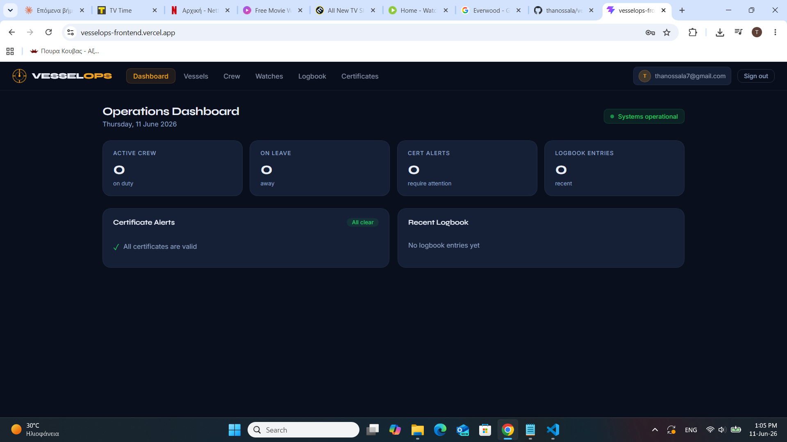
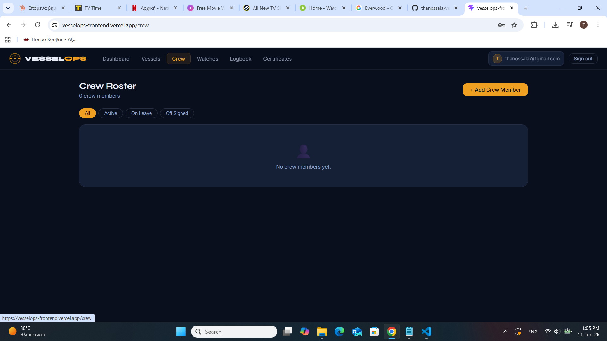
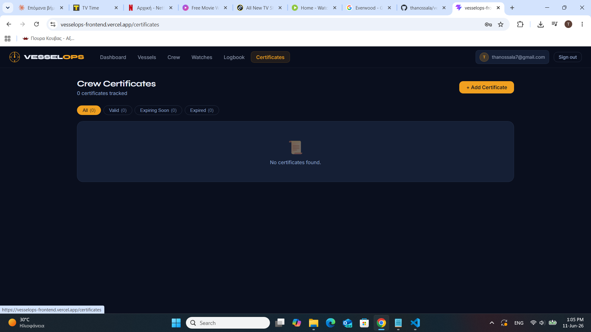
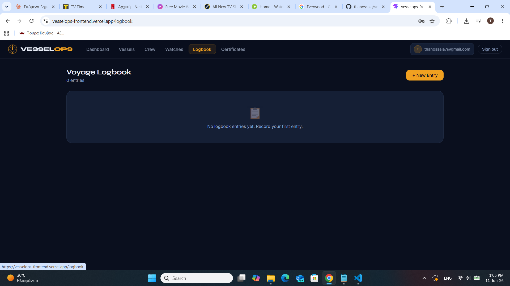

# ⚓ VesselOps — Maritime Crew Management Platform

> Built from real experience at sea. 9 months as a Cadet Officer on commercial vessels showed me how much crew management still runs on paper and spreadsheets. VesselOps is the tool I wish we had on board.

**Live demo:** https://vesselops-frontend.vercel.app  
**Demo credentials:** `captain@test.com` / `test1234`

---

## 📸 Screenshots

<!-- 
  HOW TO ADD SCREENSHOTS:
  1. Go to https://vesselops-frontend.vercel.app and log in
  2. Take a screenshot of each page (Win: Snipping Tool / Mac: Cmd+Shift+4)
  3. Save them to a /screenshots folder in this repo
  4. Replace the placeholder paths below
-->

| Dashboard | Crew Roster |
|-----------|-------------|
|  |  |

| Certificates | Logbook |
|-------------|---------|
|  |  |

---

## ✨ Features

- **Operations Dashboard** — live crew status, certificate alerts, recent logbook entries
- **Crew Management** — roster with ranks, nationalities, contract dates and status tracking
- **Watch Schedules** — assign 4-on/8-off bridge, engine, and deck watches by date
- **Digital Logbook** — record position (lat/lon), weather, sea state, speed, and course
- **Certificate Tracking** — STCW certificates with automatic `valid / expiring soon / expired` status via PostgreSQL trigger
- **JWT Authentication** — role-based access (admin, captain, officer, cadet)

---

## 🛠 Tech Stack

| Layer    | Technology                        |
|----------|-----------------------------------|
| Frontend | React 18 + TypeScript + Vite      |
| Backend  | Node.js + Express                 |
| Database | PostgreSQL (Supabase)             |
| Auth     | JWT + bcrypt                      |
| Deploy   | Vercel (frontend) + Render (API)  |
| CI       | GitHub Actions                    |

---

## 🏗 Architecture

```
vesselops-frontend/              vesselops-api/
├── src/                         ├── src/
│   ├── api/client.ts            │   ├── index.js
│   ├── context/                 │   ├── db/pool.js
│   │   └── AuthContext.tsx      │   ├── middleware/auth.js
│   ├── components/              │   └── routes/
│   │   ├── Navbar.tsx           │       ├── auth.js
│   │   ├── SkeletonLoader.tsx   │       ├── vessels.js
│   │   └── ErrorState.tsx       │       ├── crew.js
│   └── pages/                   │       ├── watches.js
│       ├── Dashboard.tsx        │       ├── logbook.js
│       ├── Crew.tsx             │       ├── certificates.js
│       ├── Vessels.tsx          │       └── dashboard.js
│       ├── Watches.tsx          └── package.json
│       ├── Logbook.tsx
│       └── Certificates.tsx
└── vercel.json
```

---

## 🗄 Database Schema

6 tables with foreign key relationships and PostgreSQL triggers:

| Table              | Purpose                                              |
|--------------------|------------------------------------------------------|
| `users`            | Auth with bcrypt passwords and role-based access     |
| `vessels`          | Vessel registry with IMO numbers and flag state      |
| `crew_members`     | Crew with contract dates, ranks, and status          |
| `watch_schedules`  | Watch assignments with conflict detection            |
| `logbook_entries`  | Position, weather, sea state, speed, and course      |
| `certificates`     | STCW certs — status auto-updated by DB trigger       |

---

## 🔌 API Endpoints

| Method              | Endpoint                  | Description             |
|---------------------|---------------------------|-------------------------|
| POST                | `/api/auth/register`      | Register user           |
| POST                | `/api/auth/login`         | Login                   |
| GET                 | `/api/vessels`            | List vessels            |
| GET/POST/PUT/DELETE | `/api/crew`               | Crew CRUD               |
| GET/POST/DELETE     | `/api/watches`            | Watch schedules         |
| GET/POST            | `/api/logbook`            | Logbook entries         |
| GET/POST/PUT/DELETE | `/api/certificates`       | STCW certificates       |
| GET                 | `/api/dashboard`          | Aggregated stats        |

All endpoints except `/api/auth` require `Authorization: Bearer <token>`.

---

## 🚀 Run Locally

### Prerequisites
- Node.js 18+
- A [Supabase](https://supabase.com) project (free tier is fine)

### Backend
```bash
cd vesselops-api
npm install
cp .env.example .env
# Fill in DATABASE_URL (from Supabase) and JWT_SECRET in .env
npm run dev
# API running at http://localhost:3000
```

### Frontend
```bash
cd vesselops-frontend
npm install
# In src/api/client.ts, set baseURL to http://localhost:3000/api
npm run dev
# App running at http://localhost:5173
```

---

## 🧪 Tests

```bash
cd vesselops-frontend
npm run test
```

---

## 💡 Background

Built by a former Merchant Navy deck officer studying Computer Science. Every feature maps to a real workflow I encountered on commercial vessels — from managing STCW certificate renewals to logging position every watch. The goal was to digitize what most ships still do on paper.

---

## 👤 Author

**Thanos Salas**  
Computer Science student @ Metropolitan College Athens  
Former Merchant Navy Cadet Officer  

[GitHub](https://github.com/thanossala) · [Portfolio](https://thanossala.github.io) · [LinkedIn](#)
